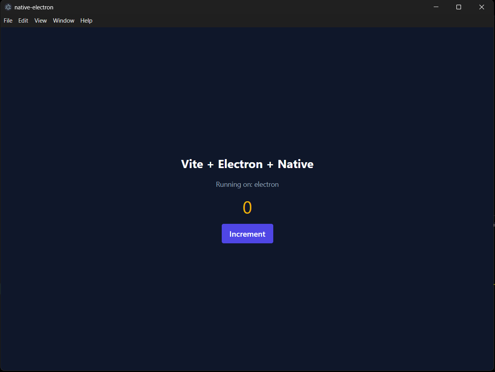
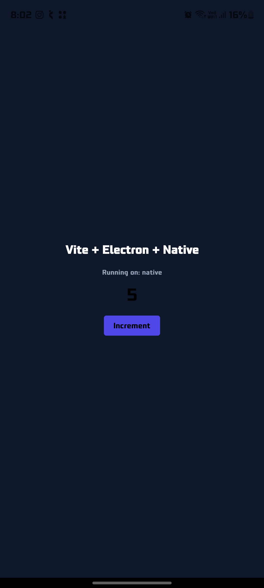

# native-electron

A single, non-monorepo React codebase that ships to three targets:

- **Web** — React + Vite
- **Desktop** — the same web build wrapped in Electron
- **Mobile** — React Native via Expo

Shared UI, hooks, and utilities live in `src/`. Platform-specific behavior
(storage, links) is isolated behind a common adapter interface in
`src/platform/{web,electron,native}`, and platform-specific rendering
primitives (`View`, `Text`, `Button`) live in `src/components/` as
`Component.jsx` (web/Electron) and `Component.native.jsx` (Expo/Metro
auto-resolves the `.native.jsx` variant on device).

<div style="display:flex; flex-direction:row; align-items:flex-start; gap:16px;">
  
  
</div>

## Structure

```
src/
  App.jsx              shared app logic and layout
  main.jsx             web/Electron entry (mounts to index.html)
  components/          shared UI primitives (+ .native.jsx variants)
  hooks/                shared hooks
  utils/                shared utilities
  styles/               Tailwind entry stylesheet
  platform/
    web/                web adapter (localStorage, window.open)
    electron/           electron adapter (IPC via preload bridge)
    native/             native adapter (in-memory store, Linking)
electron/
  main.js               Electron main process
  preload.js             contextBridge IPC bridge
native/
  index.js               Expo entry point
public/                  static assets served by Vite
```

## Setup

```
npm install
```

## Scripts

| Command                  | Description                                              |
| ------------------------ | -------------------------------------------------------- |
| `npm run dev`            | Start the Vite web dev server                            |
| `npm run build`          | Build the web app to `dist/`                             |
| `npm run preview`        | Preview the web production build                         |
| `npm run lint`           | Lint all JS/JSX                                          |
| `npm run test`           | Run the Vitest suite                                     |
| `npm run electron:dev`   | Run Electron against the Vite dev server                 |
| `npm run electron:build` | Build the web app, then package it with electron-builder |
| `npm run native:start`   | Start the Expo/Metro dev server                          |
| `npm run native:android` | Start Expo targeting an Android emulator/device          |
| `npm run native:ios`     | Start Expo targeting an iOS simulator/device             |

## Notes

- Electron's main process is launched with an explicit path
  (`electron electron/main.js`), not `electron .`, because `package.json`'s
  `main` field is reserved for Expo's Metro entry resolution
  (`native/index.js`). The packaged app's entry point is set separately via
  `extraMetadata.main` in `electron-builder.yml`.
- `expo export` defaults its output to `./dist`, the same directory Vite
  builds to. CI and any manual native export use `--output-dir build`
  to avoid clobbering the web build.
- Tailwind is shared across all three targets via `tailwind.config.js`
  (content globs cover `src/` and `native/`) and NativeWind, which consumes
  the same `src/styles/index.css` on the native target through
  `metro.config.js`.

## Releasing

1. Bump `version` in `package.json` and `app.json`.
2. Commit and tag: `git tag vX.Y.Z && git push --tags`.
3. The `release` GitHub Actions workflow builds the web, Electron
   (Windows/macOS/Linux), and native bundles, and publishes them to a
   GitHub Release with auto-generated notes.
